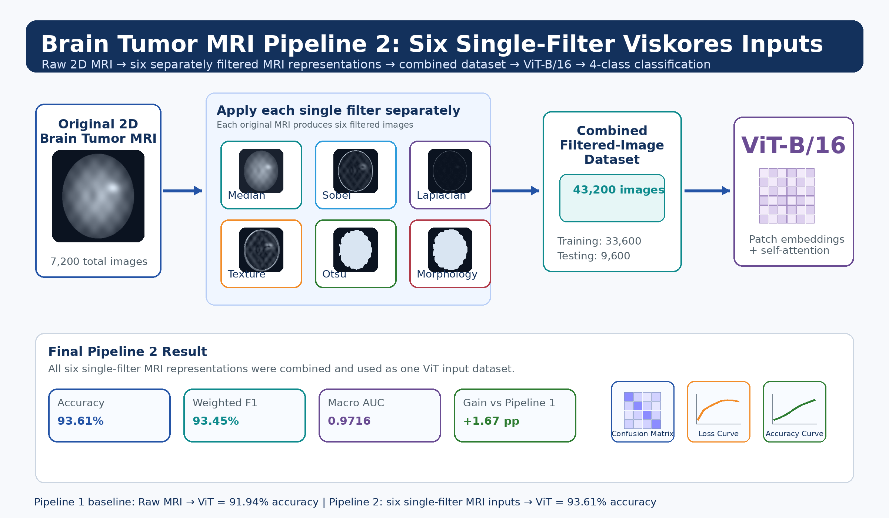
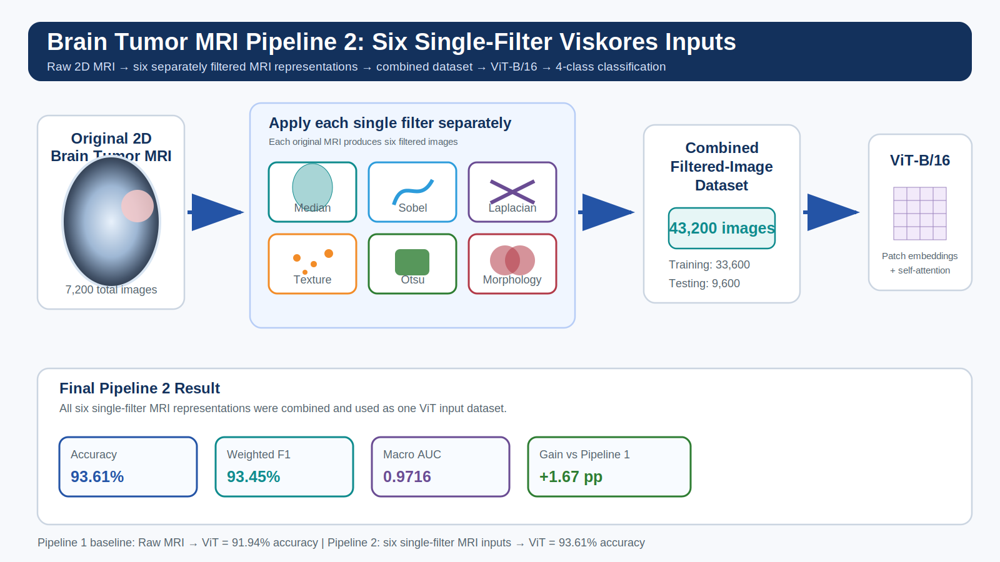

# Brain Tumor MRI Viskores 6 Single-Filter ViT Project







This repository contains the final brain tumor MRI experiment using a Viskores-enhanced Vision Transformer workflow.

## Experiment Goal

The goal of this experiment was to compare the raw MRI Vision Transformer baseline with a Pipeline 2 experiment that uses single-filter Viskores-derived MRI representations.

## Pipeline

```text
Raw 2D Brain Tumor MRI
→ apply each single filter separately
   Median, Sobel, Laplacian, Texture, Otsu, Morphology
→ combine all single-filtered images into one dataset
→ ViT-B/16
→ 4-class classification
